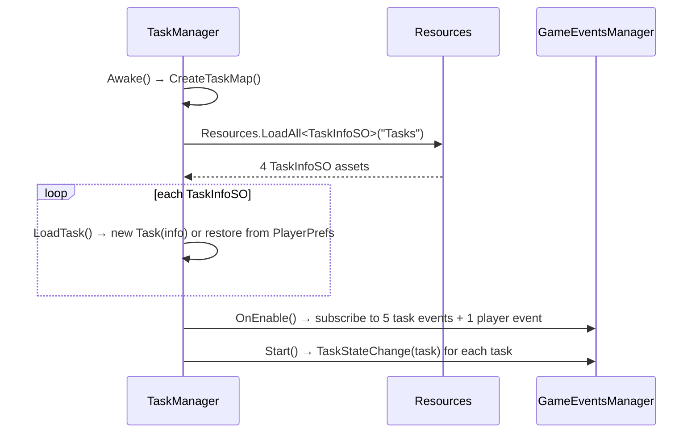

# ChemVR Task System — Architecture

How the lab modules are defined, sequenced, driven, displayed, and reset.

The Task System is the backbone of every ChemVR module. A *task* is one lab module
(Tutorial, Glove Hygiene, Glassware Use, Chemical Change). A *task step* is one instruction
in that module. Steps advance when the player performs the right physical action in the
scene, and each step is itself a prefab carrying a bespoke `MonoBehaviour` that watches for
that action.

The design is adapted from a common Unity quest-system pattern: ScriptableObject definitions,
a runtime manager, per-step prefabs, and a global event bus. "Quest" still appears in a few
leftover log messages.

---

## Contents

- [Component inventory](#component-inventory)
- [Layered view](#layered-view)
- [Data model](#data-model)
- [Runtime flow](#runtime-flow)
- [The event bus](#the-event-bus)
- [Step implementations](#step-implementations)
- [Instruction UI](#instruction-ui)
- [Module launch and scene routing](#module-launch-and-scene-routing)
- [Persistence](#persistence)
- [Checkpoint / reset subsystem](#checkpoint--reset-subsystem)
- [Developer tooling](#developer-tooling)
- [Adding a new step](#adding-a-new-step)
- [Observations and risks](#observations-and-risks)

---

## Component inventory

### Core — `Assets/Scripts/TaskSystem/`

| Script | Lines | Type | Responsibility |
|---|---|---|---|
| `TaskInfoSO.cs` | 32 | `ScriptableObject` | Authoring asset: task id, requirements, ordered step-prefab array, reward |
| `Task.cs` | 174 | plain C# class | Runtime instance of one task: current step index, per-step state, instantiation |
| `TaskManager.cs` | 251 | `MonoBehaviour` | Orchestrator. Owns the task map, subscribes to task events, drives state transitions |
| `TaskStep.cs` | 78 | abstract `MonoBehaviour` | Base class for every step behaviour; provides `FinishTaskStep()` and dev-skip |
| `TaskState.cs` | 12 | `enum` | `REQUIREMENTS_NOT_MET → CAN_START → IN_PROGRESS → CAN_FINISH → FINISHED` |
| `TaskStepState.cs` | 22 | `[Serializable]` class | Per-step `state` + `status` strings (opaque, step-defined) |
| `TaskData.cs` | 18 | `[Serializable]` class | Save snapshot: state + step index + step-state array |

### Event bus — `Assets/Scripts/Events/`

| Script | Role in the task system |
|---|---|
| `GameEventsManager.cs` | Singleton holding all eight event channels; every task-system script routes through `GameEventsManager.instance` |
| `TaskEvents.cs` | The task channel — `StartTask`, `AdvanceTask`, `AbandonTask`, `FinishTask`, `RestartTask`, `TaskStateChange`, `TaskStepStateChange`, `TaskStartApproved` |
| `PlayerEvents.cs` | `onPlayerExperimentChange` (task requirements), `PointsGained` (task rewards) |
| `InputEvents.cs` | `onBButtonPressed` (dev skip), `onWebGLSkipTask`, `onLThumbstickClicked` / `onRThumbstickClicked` (reset menu) |
| `MiscellaneousEvents.cs` | ~40 lab-specific signals (`OnScaleTare`, `OnStirBeaker`, `OnPippetConnectedFirst`, …) that individual steps listen for |
| `ChemistryEvents.cs` | `onPourOut`, `onPourIn`, `onPipetteDispense`, `onFluidDispose` |
| `InteractableEvents.cs` | `onPlayerGrabInteractable` / `Drop` / `Activate` |
| `WebGLEvents.cs` | `OnObjectGrabbed` / `OnObjectReleased` / `OnInteractPressed` — the WebGL substitute for XR grab callbacks |
| `ParticleEvents.cs` | `onShowParticles` / `onHideParticles` / `onDeleteParticles` |

### Content — `Assets/Resources/Tasks/<Module>/`

| Module | Task asset | Steps | Step scripts | Step prefabs | Overview |
|---|---|---|---|---|---|
| Tutorial | `Tutorial_Task.asset` | 8 | 8 | 8 (alongside scripts) | `Tutorial_Overview.cs` |
| Glove Hygiene | `Glove_Hygiene_Task.asset` | 13 | 15 | 15 (`Prefabs/`) | `Glove_Hygiene_Overview.cs` |
| Glassware Use | `Glassware_Use_Task.asset` | 26 | 26 | 26 (`Prefabs/`) | `Glassware_Use_Overview.cs` |
| Chemical Change | `Chemical_Change_Task.asset` | 23 | 24 | 24 (`Prefabs/`) | `Chemical_Change_Overview.cs` |

**73 concrete `TaskStep` subclasses** total. Script counts exceed step counts where steps have
been disabled in the asset but the script and prefab were kept.

### Launchers and glue — `Assets/Scripts/`

| Script | Responsibility |
|---|---|
| `StartTasks.cs` | UI entry point — `StartTutorial()` / `StartGloveHygiene()` / `StartGlasswareUse()` / `StartChemicalChange()` raise `StartTask(<id>)` |
| `Start_Module.cs` | Trivial `Show()` / `Hide()` on the instruction popup GameObject |
| `SpawnAtStation.cs` | Listens for `onTaskStartApproved` and loads the matching module scene |
| `Menu/DevOpsState.cs` | Static dev-mode flag gating step skipping |
| `Menu/HelpMenuController.cs` | In-game menu; loads module scenes by name |

### Reset subsystem — `Assets/Scripts/ResetTaskSystem/`

| Script | Responsibility |
|---|---|
| `ResetTaskManager.cs` | Reads the live step index from `TaskManager`, restores the matching checkpoint |
| `ModuleCheckpointsSO.cs` | Container asset mapping step index → `TaskCheckpointSO` |
| `TaskCheckpointSO.cs` | One checkpoint: a list of `ObjectState` |
| `ObjectState.cs` | Serialized transform, velocity, and fluid contents for one tracked object |
| `TrackedObject.cs` | Marker component — tags a scene object as resettable |
| `CheckpointRecorder.cs` | Editor-side tool for capturing checkpoint states |
| `ResetTaskMenuComponent.cs` | Confirm-reset UI |

---

## Layered view

```
┌──────────────────────────────────────────────────────────────────────┐
│ AUTHORING (Editor)                                                   │
│   TaskInfoSO asset  ──ordered array of──▶  step prefabs              │
│   Resources/Tasks/<Module>/<Module>_Task.asset                        │
└───────────────────────────────┬──────────────────────────────────────┘
                                │ Resources.LoadAll<TaskInfoSO>("Tasks")
                                ▼
┌──────────────────────────────────────────────────────────────────────┐
│ ORCHESTRATION                                                        │
│   TaskManager (MonoBehaviour, on "The Managers")                     │
│     taskMap : Dictionary<string, Task>                               │
│     instantiates the current step prefab as its own child            │
└───────────────┬───────────────────────────────────┬──────────────────┘
                │ publishes / subscribes            │ Instantiate
                ▼                                   ▼
┌───────────────────────────────┐   ┌──────────────────────────────────┐
│ EVENT BUS                     │   │ STEP BEHAVIOUR                   │
│   GameEventsManager.instance  │◀─▶│   TaskStep subclass on a prefab  │
│     .taskEvents               │   │   watches scene interactions     │
│     .miscEvents               │   │   calls FinishTaskStep()         │
│     .chemistryEvents  …       │   └──────────────────────────────────┘
└───────────────┬───────────────┘
                │ onAdvanceTask / onAbandonTask
                ▼
┌──────────────────────────────────────────────────────────────────────┐
│ PRESENTATION + ROUTING                                               │
│   <Module>_Overview  → instruction text in the popup canvas          │
│   SpawnAtStation     → scene load on TaskStartApproved               │
│   ResetTaskManager   → checkpoint restore at the current step        │
└──────────────────────────────────────────────────────────────────────┘
```

The important structural property: **`TaskManager` never references a step behaviour, and a
step behaviour never references `TaskManager`.** All coupling goes through
`GameEventsManager.instance.taskEvents`. A step knows only its own `taskId` and `stepIndex`,
handed to it at instantiation.

---

## Data model

### `TaskInfoSO` — the authoring asset

```csharp
[CreateAssetMenu(menuName = "ScriptableObjects/TaskInfoSO")]
public class TaskInfoSO : ScriptableObject
{
    public string id { get; private set; }   // forced to asset name in OnValidate()
    public string displayName;
    public int experimentRequirement;        // gate: player must be in this experiment
    public int pointRequirement;             // declared, never checked
    public TaskInfoSO[] taskPrerequisites;   // gate: these tasks must be FINISHED
    public GameObject[] taskStepPrefabs;     // ← the ordered step sequence
    public int pointsReward;
}
```

`OnValidate()` forces `id = this.name`, so the asset filename *is* the task id. That id is
what `StartTasks` and the overview scripts pass to `StartTask(...)` — rename the asset and
those string literals break.

Reordering `taskStepPrefabs` in the inspector reorders the module. This array is the single
source of truth for step sequence.

### `Task` — the runtime instance

```csharp
public class Task
{
    public TaskInfoSO info;              // static definition
    public TaskState state;
    private int currentTaskStepIndex;
    private TaskStepState[] taskStepStates;
}
```

Not a `MonoBehaviour` — a plain object held in `TaskManager.taskMap`. Its methods:

| Method | Effect |
|---|---|
| `InstantiateCurrentTaskStep(parent)` | Instantiates `taskStepPrefabs[i]` under `parent`, then calls `InitializeTaskStep(id, i, savedState)` |
| `MoveToNextStep()` | `currentTaskStepIndex++` |
| `CurrentStepExists()` | Bounds check against the prefab array |
| `StartOver()` | Destroys the live step object (by name lookup) and resets the index to 0 |
| `Kill()` | Destroys `"<taskName>_<index>(Clone)"` via `GameObject.Find` |
| `StoreTaskStepState(state, i)` | Writes a step's state/status into the array |
| `GetTaskData()` | Snapshot for saving |
| `GetFullStatusText()` | Renders completed steps with `<s>strikethrough</s>` markup plus the current step |

### `TaskState`

```
REQUIREMENTS_NOT_MET ──requirements met──▶ CAN_START ──StartTask──▶ IN_PROGRESS
                                               ▲                        │
                                               │                        │ AdvanceTask
                                          AbandonTask                   │ (no steps left)
                                               │                        ▼
                                               └─────────────────  CAN_FINISH
                                                                        │ FinishTask
                                                                        ▼
                                                                    FINISHED
```

### `TaskStepState` and `TaskData`

`TaskStepState` is deliberately generic — two free-form strings, `state` (step-defined
resume data) and `status` (player-facing status line). Steps interpret `state` via the
abstract `SetTaskStepState(string)` hook. `TaskData` bundles `state + index + step states`
for JSON serialization.

---

## Runtime flow

### Startup



`CreateTaskMap()` loads **every** `TaskInfoSO` under `Assets/Resources/Tasks`, regardless of
scene. All four modules exist in the map in every scene; only the one that receives a
`StartTask` is active.

### Step advance — the main loop

```mermaid
sequenceDiagram
    participant P as Player
    participant S as TaskStep (prefab instance)
    participant GE as taskEvents
    participant TM as TaskManager
    participant T as Task
    participant OV as Module_Overview

    P->>S: performs the physical action
    S->>S: FinishTaskStep()
    S->>GE: AdvanceTask(taskId)
    S->>S: Destroy(gameObject)
    GE-->>TM: onAdvanceTask
    TM->>T: MoveToNextStep()
    alt more steps remain
        TM->>T: InstantiateCurrentTaskStep(TaskManager.transform)
        T->>S: new prefab instance, InitializeTaskStep(id, index, state)
    else no steps left
        TM->>TM: ChangeTaskState(id, CAN_FINISH)
    end
    GE-->>OV: onAdvanceTask
    OV->>OV: curStep++ ; set popup text
```

Two independent listeners react to the same `onAdvanceTask`: `TaskManager` (spawns the next
step prefab) and the module's `_Overview` (updates the instruction text). They each keep
their own counter.

### Requirement polling

`TaskManager.Update()` iterates every task every frame:

```csharp
foreach (Task task in taskMap.Values)
    if (task.state == REQUIREMENTS_NOT_MET && CheckRequirementsMet(task))
        ChangeTaskState(task.info.id, CAN_START);
```

`CheckRequirementsMet` compares `currentPlayerExperiment` against `experimentRequirement` and
verifies all `taskPrerequisites` are `FINISHED`. In shipped content all four assets have
`experimentRequirement = 0`, `pointRequirement = 0`, `pointsReward = 0`, and no prerequisites
— so every task transitions to `CAN_START` on the first frame and the gating machinery is
inert. It is scaffolding for future sequencing.

---

## The event bus

`GameEventsManager` is a scene singleton (`instance` set in `Awake`, error logged on
duplicates) that constructs eight event-channel objects. Every channel follows the same
shape:

```csharp
public event Action<string> onAdvanceTask;
public void AdvanceTask(string id)
{
    if (onAdvanceTask != null) onAdvanceTask(id);
}
```

Publishers call the method; subscribers register on the event in `OnEnable` and deregister in
`OnDisable`. This gives steps a way to observe arbitrary lab hardware (`OnScaleTare`,
`OnHoodSashHeightSet`, `OnBeakerOnHotPlate`, `onPourIn`, …) without either side holding a
reference to the other.

`taskEvents` in particular:

| Event | Published by | Consumed by |
|---|---|---|
| `onStartTask` | `StartTasks`, `_Overview.OnEnable` | `TaskManager.StartTask` |
| `onAdvanceTask` | `TaskStep.FinishTaskStep` | `TaskManager.AdvanceTask`, all four `_Overview` scripts |
| `onAbandonTask` | UI / restart paths | `TaskManager.AbandonTask`, `_Overview.<x>_abandonMe` |
| `onFinishTask` | — | `TaskManager.FinishTask` |
| `onTaskStepStateChange` | `TaskStep.ChangeState` | `TaskManager.TaskStepStateChange` |
| `onTaskStateChange` | `TaskManager.ChangeTaskState` | *(no subscribers in the project)* |
| `onTaskStartApproved` | the four `Put_On_Gear_*` / `Hide_and_Unhide_Popup` steps | `SpawnAtStation.startedNewModule` |
| `onRestartTask` | *(none)* | *(none)* |

Two channels are currently dead ends: `onTaskStateChange` is broadcast but nothing listens,
and `onRestartTask` is neither raised nor consumed.

---

## Step implementations

Every step is `abstract class TaskStep : MonoBehaviour`:

```csharp
public abstract class TaskStep : MonoBehaviour
{
    private bool isFinished;
    private string taskId;
    private int stepIndex;

    protected void Start()      => inputEvents.onBButtonPressed += DevSkipTask;
    protected void OnDestroy()  => inputEvents.onBButtonPressed -= DevSkipTask;

    public void InitializeTaskStep(string taskId, int stepIndex, string taskStepState);
    protected void FinishTaskStep();                              // → AdvanceTask + self-destruct
    protected void FinishTaskStepWithDelay(float min, float max); // randomized delay variant
    protected void ChangeState(string newState, string newStatus);
    protected abstract void SetTaskStepState(string state);       // resume hook
}
```

A concrete step subscribes to whatever signals represent its completion condition, then calls
`FinishTaskStep()`. The base class handles advancing the task and destroying itself, and the
`isFinished` guard makes double-completion harmless.

`Inspect_Glassware` is representative of the more involved steps:

- Resolves target objects by name via `GameObject.Find` against a hardcoded `glasswareNames[]`.
- Branches on platform: VR subscribes to `XRGrabInteractable.selectEntered`; WebGL subscribes
  to `webGLEvents.OnObjectGrabbed`.
- Tracks an `inspected` flag per item and calls `FinishTaskStep()` once all are true.
- Also subscribes to `inputEvents.onWebGLSkipTask` as an escape hatch.

The dual VR / WebGL branch inside step logic — driven by `Application.platform ==
RuntimePlatform.WebGLPlayer` — recurs across the step library and is the main source of
per-step complexity.

**Step prefabs** live next to their scripts (`Resources/Tasks/<Module>/Prefabs/`, or directly
in the module folder for Tutorial). Each prefab is an otherwise-empty GameObject carrying one
step script. `TaskManager` instantiates them as its own children, so at runtime "The Managers"
has exactly one step child while a module is in progress.

---

## Instruction UI

Each module has a `<Module>_Overview` MonoBehaviour that owns the popup instruction text.
Structure (using `Glassware_Use_Overview` as the example):

```csharp
public TextMeshProUGUI guText;
int curStep;
public bool isWebGL;
public Start_Module taskPreper;

static string[] text     = { /* 27 entries */ };  // VR wording
       string[] webGLText = { /* 27 entries */ }; // mouse/keyboard wording

void OnEnable()
{
    taskEvents.onAbandonTask += gu_abandonMe;
    taskEvents.onAdvanceTask += AdvanceGlaTask;
    taskPreper.Show();
    taskEvents.StartTask("Glassware_Use_Task");
    guText.text = isWebGL ? webGLText[0] : text[0];
}

void AdvanceGlaTask(string context)
{
    if (context.Contains("Glassware_Use_Task"))
        guText.text = isWebGL ? webGLText[++curStep] : text[curStep];
}
```

Note that the overview both **starts** the module (in `OnEnable`) and **narrates** it. Loading
a module scene therefore auto-starts its task; `StartTasks` is the alternative, menu-driven
path.

**The arrays are sized N+1 for N steps** — the extra final entry is the completion message
shown after the last step advances. Verified across all four modules:

| Module | Step prefabs | `text[]` | `webGLText[]` |
|---|---|---|---|
| Tutorial | 8 | 9 | — |
| Glove Hygiene | 13 | 14 | 14 |
| Glassware Use | 26 | 27 | 27 |
| Chemical Change | 23 | 24 | — |

Tutorial and Chemical Change have no WebGL text variant, so their WebGL ports show
controller-oriented wording.

Supporting UI scripts: `ToggleTextSimple` (popup visibility, enabled/disabled by the overview),
`Start_Module` (`Show()`/`Hide()`), `PopupHighlighter`, `HintController`.

---

## Module launch and scene routing

There are two ways a task starts, and a separate mechanism for scene transitions:

```
1. Menu path:    StartTasks.StartGlasswareUse() ──▶ taskEvents.StartTask("Glassware_Use_Task")
2. Scene path:   Glassware_Use_Overview.OnEnable() ──▶ taskEvents.StartTask("Glassware_Use_Task")

3. Scene routing: Put_On_Gear_GU (step 0) ──▶ taskEvents.TaskStartApproved("Glassware_Use")
                                                    │
                                                    ▼
                              SpawnAtStation.startedNewModule("Glassware_Use")
                                                    │
                                          substring match on "gla"
                                                    ▼
                                  SceneManager.LoadScene("LabSceneGlasswareUse")
```

`SpawnAtStation` matches on lowercased substrings — `"glo"` → Glove Hygiene, `"che"` →
Chemical Change, `"gla"` → Glassware Use, `"tut"` → Tutorial. Its original purpose was
teleporting the rig to a spawn marker (`GameObject.Find("Glassware Use Spawn")` etc.); that
code is commented out and replaced with a full scene load.

`StartTasks.RemoveUnstarted()` destroys any `TaskManager` child whose name contains `"_0"`
before starting a new task — a cleanup for step-0 prefabs left over from a previously
auto-started module.

---

## Persistence

Saving is intentionally provisional. `TaskManager` comments call it "a temporary thing just to
demonstrate the concept."

- **Write:** `OnApplicationQuit()` → for each task, `JsonUtility.ToJson(TaskData)` →
  `PlayerPrefs.SetString(task.info.id, json)`.
- **Read:** `LoadTask()` in `Awake`, but only when the `loadTaskState` inspector bool is true
  *and* a PlayerPrefs key exists. Otherwise a fresh `Task` is constructed.
- **Config:** `[SerializeField] private bool loadTaskState = false` — off by default, so
  shipped builds always start modules from step 0.

`loadTaskState` also changes `StartTask` behaviour: when false, `StartTask` calls
`task.StartOver()` first, guaranteeing a clean run.

The `Task(TaskInfoSO, TaskState, int, TaskStepState[])` constructor logs a warning when the
saved step-state array length disagrees with the current prefab array — the intended signal
that content changed under saved data.

---

## Checkpoint / reset subsystem

A separate system layered on top of the task system, letting a player recover from a
physics mishap (glassware knocked into the void, fluid in the wrong container) without
restarting the module.

```
ResetTaskManager
  ├─ taskInfoObjectID : string        ← must exactly match the TaskInfoSO id
  ├─ CheckpointContainer : ModuleCheckpointsSO
  └─ trackedObjects : List<GameObject>  ← every TrackedObject in the scene, gathered in Start()

ResetCurrentTask():
  1. fire onResetCalled                       (PipetteFunctions, TrackedObject listen)
  2. int step = taskManager.GetCurrentStepIndex(taskInfoObjectID)
  3. TaskCheckpointSO cp = CheckpointContainer.GetCheckpoint(step)
  4. for each tracked object matching an ObjectState by name:
         restore fluid contents  (if isChemContainer → ChemContainer.SetChem/UpdateChem)
         restore transform + rigidbody velocities — UNLESS the object is:
            · currently grabbed        (XRGrabInteractable.isSelected)
            · a bulb snapped to a pipette   (SnapBulbToPipet.GetSnap())
            · paper snapped in a boat       (Put_Paper_on_Boat.GetHasSnapped())
            · glassware snapped to the tray (SnapToTray.GetIsSnapped())
```

`TaskManager.GetCurrentStepIndex(string id)` exists solely for this subsystem — it is the only
public accessor on `TaskManager`, added (per its comment) "to make checkpoint system work
properly."

Input binding: left thumbstick click toggles the confirm menu, right thumbstick click
confirms. `ResetTaskManager` is a second singleton, independent of `GameEventsManager`.

Checkpoint data is authored with `CheckpointRecorder` and stored as `TaskCheckpointSO` assets
under `Assets/Scripts/ResetTaskSystem/CheckpointObjects/`, one checkpoint per step index.

---

## Developer tooling

| Mechanism | Trigger | Guard |
|---|---|---|
| Dev skip (VR) | **B button** → `TaskStep.DevSkipTask` → `FinishTaskStep()` | `DevOpsState.IsDevOpsEnabled()` |
| Skip (WebGL) | `inputEvents.onWebGLSkipTask` → per-step `SkipTask` handler | none — always active where implemented |
| Dev-ops toggle | `DevOpsManager` in the Start Menu → `DevOpsState.ToggleDevOps()` | — |
| Task reset | thumbstick clicks → `ResetTaskManager` | confirm menu |

`DevOpsState` is a static class with a single bool, defaulting to `false`; its comment marks
the line to change for a dev build.

Note the asymmetry: the VR skip is gated behind dev-ops mode, but steps that implement
`onWebGLSkipTask` wire it up unconditionally.

---

## Adding a new step

The procedure is documented in a comment block inside `Glassware_Use_Overview.cs`:

1. Add the instruction string to the module's `text[]` (and `webGLText[]`) array, in position.
2. Duplicate an existing step script in `Assets/Resources/Tasks/<Module>/` — pick one whose
   completion condition resembles yours.
3. Rename the file **and** the class inside it (they must match or it will not compile).
4. Duplicate a step prefab in `<Module>/Prefabs/`, rename it to match the script, and swap its
   script component.
5. Drag the prefab into `taskStepPrefabs` on the module's `TaskInfoSO`, at the matching index.

Steps 1 and 5 must agree on index, and the array must stay N+1 (see
[Instruction UI](#instruction-ui)). Nothing validates this at build time.

To disable a step, remove its prefab from `taskStepPrefabs` and comment out the matching
string. The existing content shows this pattern in use — several Glassware Use strings are
commented out with `//disabled task step N (add to TaskInfoSO block and uncomment to undo)`.

---

## Observations and risks

Recorded from reading the code; these are characterizations, not verified runtime failures.

### Structural

1. **Parallel step counters.** `TaskManager` tracks `currentTaskStepIndex` inside `Task`;
   each `_Overview` tracks its own `curStep`. Nothing reconciles them. Any path that changes
   one without firing `onAdvanceTask` (a reset, an abandoned start, a duplicated event)
   desynchronizes the instruction text from the live step.

2. **String-name coupling.** Task ids are asset filenames; `StartTasks`,
   `ResetTaskManager.taskInfoObjectID`, and each overview's `context.Contains(...)` check all
   hardcode them. Renaming a `*_Task.asset` silently breaks all three.

3. **`GameObject.Find` for lifecycle control.** `Task.StartOver()` reconstructs a clone name
   by string surgery — locating `"("`, splicing in `"Clone"`, removing a space — and
   `Task.Kill()` builds `"<name>_<index>(Clone)"`. Both are sensitive to prefab naming and to
   Unity's clone-naming behaviour. Step behaviours also locate their targets by name
   (`Inspect_Glassware`'s `glasswareNames[]`), which is why scene object renames break steps.

4. **Per-frame requirement polling.** `TaskManager.Update()` walks all tasks every frame to
   test requirements that, in current content, are satisfied on frame 1 and never change. An
   event-driven re-check would remove the loop.

5. **Platform branching inside steps.** Each step re-implements its own VR/WebGL fork. An
   input-abstraction layer above `webGLEvents` / `XRGrabInteractable` would remove the
   duplication — this is the largest single source of step-script complexity.

### Defects worth confirming

6. **`GetTaskById` cannot return null.** `taskMap[id]` throws `KeyNotFoundException` on a
   missing id, so the following `if (task == null)` error log is unreachable. A mistyped task
   id produces an exception rather than the intended diagnostic. `TryGetValue` would restore
   the intended behaviour.

7. **Null dereference in `LoadTask`'s catch block.** The handler logs
   `"Failed to load task with id " + task.info.id` — but `task` is precisely what failed to be
   assigned, so the catch throws `NullReferenceException` and masks the original error. Should
   reference `taskInfo.id`.

8. **`OnApplicationQuit` on WebGL.** Save is triggered only from `OnApplicationQuit`, which is
   unreliable in browsers (tab close does not guarantee it). With `loadTaskState` false by
   default this is currently inert, but it will matter if persistence is turned on for the
   WebGL build.

9. **Base-method hiding in two steps.** `TaskStep.Start()` and `OnDestroy()` are `protected`
   and non-virtual. `Chemical_Change/Weigh_CrCl3.cs` and `Glove_Hygiene/Remove_Gloves.cs`
   each declare their own `Start`/`OnDestroy`. Where a subclass declares the same method, the
   base implementation does not run — meaning the dev-skip subscription (and its matching
   unsubscribe) is silently skipped for that step. Making the base methods `protected virtual`
   and requiring `base.Start()` would make this explicit.

### Unused scaffolding

10. `pointRequirement` is declared on `TaskInfoSO` and never read.
11. `displayName` is empty on all four assets and never read.
12. `pointsReward` is 0 everywhere; `ClaimRewards` fires `PointsGained(0)`.
13. `onRestartTask` has no publishers and no subscribers.
14. `onTaskStateChange` is broadcast on every state change with no subscribers.
15. `Task.GetFullStatusText()` renders a full strikethrough progress list; nothing calls it.
16. `currentPlayerExperiment` carries a `// TODO: Figure out what this is for` comment.

---

## File map

```
Assets/Scripts/TaskSystem/          core model + orchestrator (7 scripts)
Assets/Scripts/Events/              event bus (11 scripts)
Assets/Scripts/ResetTaskSystem/     checkpoint / reset (7 scripts)
Assets/Scripts/StartTasks.cs        module launch API
Assets/Scripts/Start_Module.cs      popup show/hide
Assets/Scripts/SpawnAtStation.cs    scene routing
Assets/Scripts/Menu/DevOpsState.cs  dev-skip gate

Assets/Resources/Tasks/
├── Tutorial/           Tutorial_Task.asset      +  8 steps  + Tutorial_Overview.cs
├── Glove_Hygiene/      Glove_Hygiene_Task.asset + 13 steps  + Glove_Hygiene_Overview.cs
├── Glassware_Use/      Glassware_Use_Task.asset + 26 steps  + Glassware_Use_Overview.cs
└── Chemical_Change/    Chemical_Change_Task.asset + 23 steps + Chemical_Change_Overview.cs
```

Runtime home: all managers live on the **`The Managers`** prefab, instanced under the
`Managers` root in every module scene (see [Scenes.md](Scenes.md)).
